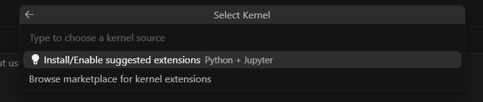

# Company Agent with UiPath - Prerequisites and Setup

This repository contains a sample implementation of a Company Agent with UiPath, demonstrating how to build enterprise-grounded AI agents that can access company policies, handle procurement requests, and manage HR tasks.

## Table of Contents
- [Common Prerequisites](#common-prerequisites)
- [macOS Prerequisites](#macos-prerequisites)
- [Windows Prerequisites](#windows-prerequisites)
- [UiPath Cloud Configuration](#uipath-cloud-configuration)
- [Anthropic Configuration](#anthropic-configuration)
- [Getting Started](#getting-started)

## Common Prerequisites

### Required Software
1. **UV Package Manager**
   - Fast Python package installer and resolver (handles Python installation)
   - Installation options:
     - Using pip (if Python exists): `pip install uv`
     - Using pipx: `pipx install uv`
     - Download from: https://github.com/astral-sh/uv
   - Verify installation: `uv --version`

2. **Git**
   - For version control and cloning the repository
   - Check version: `git --version`

3. **Node.js and npm** (For MCP Server integration)
   - Required for running the MCP remote client
   - Node.js v14.0 or higher required
   - Download from: https://nodejs.org/
   - Check versions: `node --version` and `npm --version`

4. **Jupyter** (For running the notebook)
   - Interactive development environment for the agent
   - Installation: `uv pip install jupyter`
   - Full installation guide: https://jupyter.org/install
   - Check version: `jupyter --version`

5. **Cursor** (AI-Powered Code Editor)
   - Modern AI-enhanced code editor
   - Download from: https://cursor.sh/
   - Check version: `cursor --version`

### Optional Software
6. **Claude Desktop App** (Optional but recommended)
   - Download from: https://claude.ai/download
   - Used for testing the agent via MCP Server integration

### Python Dependencies
The project uses UV for dependency management. Core dependencies include:
- `uipath-langchain>=0.0.106` - UiPath integration for LangChain
- `langchain-anthropic>=0.3.8` - Anthropic Claude integration
- `langchain-openai` - OpenAI GPT integration
- `ipykernel` - Jupyter notebook support
- `jupyter` - Jupyter notebook environment
- `pexpect` - Process spawning for authentication

## macOS Prerequisites

### System Requirements
- macOS 11 (Big Sur) or later

### macOS-Specific Configuration

- **Terminal Access**: Ensure Terminal has Full Disk Access in System Preferences > Security & Privacy

- **SSL Certificates**: macOS may require additional certificates for HTTPS requests:
  ```bash
  uv pip install --upgrade certifi
  ```

  If the SSL Certificates validation still fails with error `https.ConnectError: [SSL: CERTIFY_VERIFY_FAILED]`, the problem could be caused by a proxy, and trusting the proxy CA might help:
  ``` bash
  # example for mitmproxy
  export SSL_CERT_FILE=~/.mitmproxy/mitmproxy-ca-cert.pem
  ```

## Windows Prerequisites

### System Requirements
- Windows 10 version 1903 or later / Windows 11
- PowerShell 5.1 or later

### Windows-Specific Configuration

- **Execution Policy**: May need to allow script execution:
  ```powershell
  Set-ExecutionPolicy -ExecutionPolicy RemoteSigned -Scope CurrentUser
  ```
- **Long Path Support**: Enable for deep directory structures:
  ```powershell
  New-ItemProperty -Path "HKLM:\SYSTEM\CurrentControlSet\Control\FileSystem" -Name "LongPathsEnabled" -Value 1 -PropertyType DWORD -Force
  ```

## UiPath Cloud Configuration

### 1. UiPath Account Setup

1. **Create UiPath Account**:
   - Sign up at: https://staging.uipath.com/
   - Choose appropriate license type (Community or Enterprise)

2. **Generate Personal Access Token (PAT)**:
   - Go to User Profile > Preferences > Personal Access Tokens
   - Click "Generate Token"
   - Name: "Company Agent Token"
   - Expiration: Set appropriate duration
   - Scope: Select "Orchestrator API Access (All)"
   - **Important**: Save the token securely - it won't be shown again

## Anthropic Configuration

### Setting up Anthropic Account

1. **Create Anthropic Account**:
   - Sign up at: https://console.anthropic.com/
   - Complete the account verification process

2. **Generate API Key**:
   - Go to your Anthropic Console
   - Navigate to API Keys section
   - Click "Create Key"
   - Name: "Company Agent Key"
   - **Important**: Copy and save the API key securely - it won't be shown again

3. **API Key Usage**:
   - The Claude models (claude-3-5-sonnet, claude-3-opus, etc.) will be used for the AI agent
   - Ensure you have sufficient credits or billing set up
   - Monitor usage through the Anthropic Console

## Getting Started

1. **Clone the repository**:
   ```bash
   git clone <repository-url>
   cd fusion25-prodev-lab
   ```

2. **Run prerequisites checker** (optional but recommended):

   Before getting started, you can run the prerequisites checker script to verify all required software is installed. These scripts will check for: `UV Package Manager`, `git`, `Node.js (v14.0+)`, `npm`, `Jupyter`, `Cursor`.

   ```bash
   # Windows
   .\resources\prerequisites\check-prerequisites.ps1

   # macOS/Linux
   chmod +x ./resources/prerequisites/check-prerequisites.sh
   ./resources/prerequisites/check-prerequisites.sh
   ```

   Follow the instructions and install any missing software.

3. **Set up environment**:
   ```bash
   uv venv -p 3.11
   ```

4. **Environment Variables** (`.env` file):
   Create a `.env` file in the project root with:
   ```env
   UIPATH_FOLDER_PATH=Payments  # or your specific folder
   ANTHROPIC_API_KEY=your-anthropic-api-key
   ```

5. **Run the Jupyter Notebook With Cursor**:

   First run the `hello-world.ipynb` file.

   Install the recommended `Python` + `Jupyter` extensions

   

6. *(alternative)* **Run the Jupyter Notebook With Jupyter**:

   ```bash
   # first run the hello-world
   jupyter notebook hello-world.ipynb
   ```

   ```bash
   # then continue wuth the agent
   jupyter notebook agent.ipynb
   ```

7. **Select the kernel**:
   - In Jupyter, select Kernel > Change Kernel
   - Choose the virtual environment you created

## Project Structure

```
fusion25-prodev-lab/
├── agent.ipynb          # Main Jupyter notebook
├── resources/            # Images and resource files
│   ├── company_policy.txt
│   ├── main.py          # Single agent implementation
│   ├── main_multiple_agents.py
│   ├── prerequisites/   # Prerequisites checker scripts
│   │   ├── check-prerequisites.ps1  # Windows script
│   │   └── check-prerequisites.sh   # macOS/Linux script
│   └── ...
├── main.py              # Generated agent code
├── input.json           # Test input file
├── pyproject.toml       # Project configuration
├── .env                 # Environment variables (create this)
└── README.md            # This file
```

## Support

For issues and questions:
- UiPath Documentation: https://docs.uipath.com/
- UiPath Community Forum: https://forum.uipath.com/
- GitHub Issues: [Create an issue in this repository]

## License

This is a sample project for educational purposes. Please refer to your organization's licensing agreements for UiPath and AI model usage.